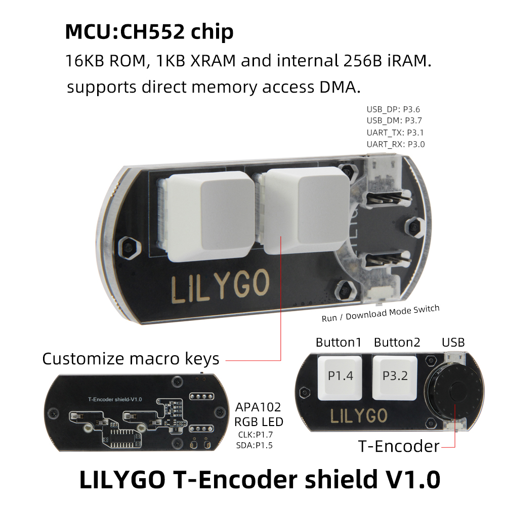
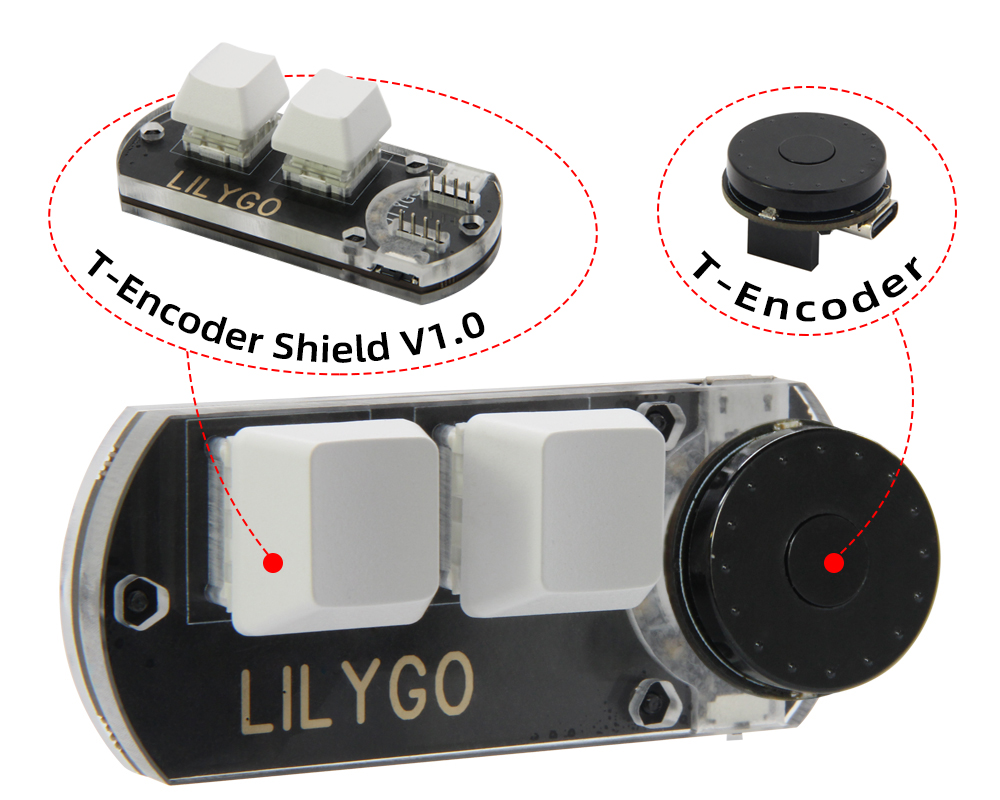
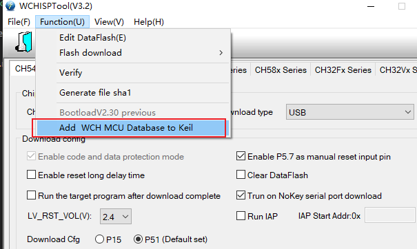
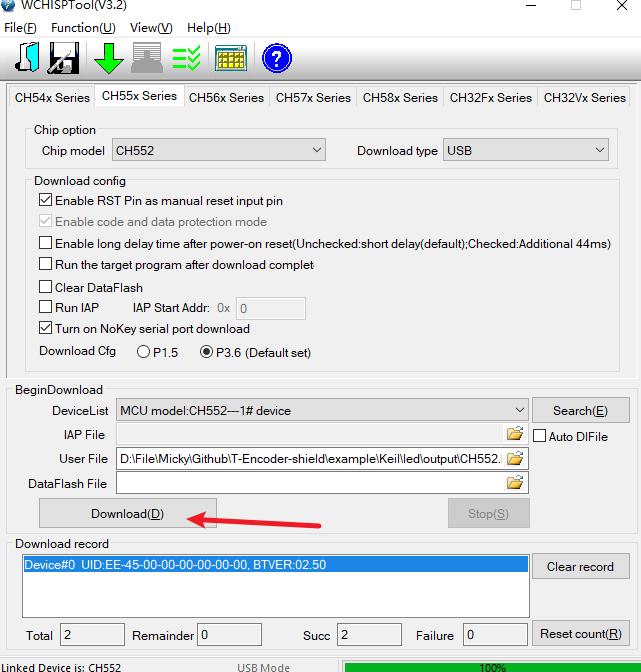
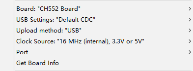

<h1 align = "center"> 🌟LilyGO T-Encoder-shield🌟</h1>

# Describe:
 It can independently connect USB to communicate with the computer in HID or other ways. (such as simulating keyboard key copy and paste), with multiple color adjustable LED light beads. Can be combined with T-Encoder to communicate via uart. Make up for the defect that T-Encoder has no USB function.

# Development method

> Enter the download mode: Disconnect the USB connection first, then turn the toggle switch to the left and then connect the USB.

## keil :
* Add chip components in keil

* Open the T-Encoder-shield.uvproj file in the example\factory directory to open the factory test project.
* When creating your own project, you can add the SDK in the example\CH554EVT_2 directory. A peripheral driver can be used alone to save flash space.
* Use the `WCHISPTool` tool in the tools directory to select the CH552 model and the xxx.HEX file compiled by keil. Click the download button. 

## Arduino
[ch55xduino](https://github.com/DeqingSun/ch55xduino)

Automatic IDE integration is supported via the
Arduino Boards Manager. This is the recommanded way of installation now. 

Start the Arduino-IDE. In *File->Preferences*, *Settings* tab, enter

> https://raw.githubusercontent.com/DeqingSun/ch55xduino/ch55xduino/package_ch55xduino_mcs51_index.json

as an *Additional Boards Manager URL*.

* Open *Tools->Board:...->Boards Manager*
* Find Ch55xduino by typing 'ch' into the search line
* Click on the list entry
* Click on *Install*.
* Configure Chip Settings.

| Product    |  Product Link  |
| :--------: | :------------: |
| T-Encoder-shield   | [Aliexpress](https://s.click.aliexpress.com/e/_oDf5t9T)  |
